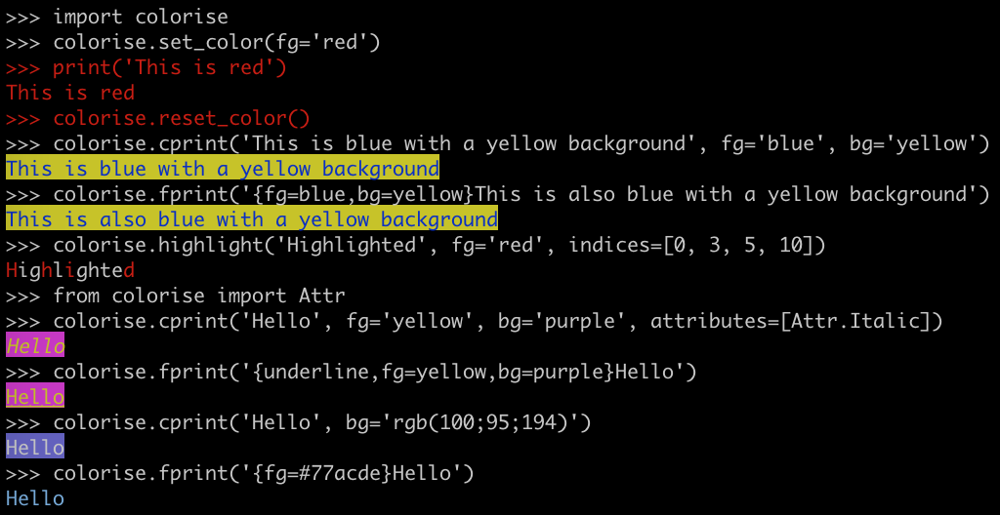

.. colorise documentation master file, created by
   sphinx-quickstart on Tue Oct 29 16:29:47 2019.
   You can adapt this file completely to your liking, but it should at least
   contain the root `toctree` directive.

.. image:: https://img.shields.io/pypi/v/colorise.svg
   :target: https://pypi.python.org/pypi/colorise/

.. image:: https://img.shields.io/github/workflow/status/MisanthropicBit/colorise/ci/master
   :alt: Build status
   :target: https://github.com/MisanthropicBit/colorise/actions

.. image:: https://readthedocs.org/projects/colorise/badge/?version=latest
   :target: https://colorise.readthedocs.io/en/latest/?badge=latest
   :alt: Documentation Status

.. image:: https://img.shields.io/pypi/wheel/colorise
   :alt: Wheel support
   :target: https://img.shields.io/pypi/wheel/colorise

.. image:: https://img.shields.io/github/license/MisanthropicBit/colorise.svg
   :alt: License
   :target: https://img.shields.io/github/license/MisanthropicBit/colorise.svg

.. image:: https://img.shields.io/pypi/pyversions/colorise.svg
   :alt: Python Versions
   :target: https://pypi.python.org/pypi/colorise/

.. toctree::
   :maxdepth: 2
   :hidden:

   tutorial
   screenshots
   faq
   changelog
   modules
   tested_systems

colorise is a Python module for printing colored text in terminals.

You can install it via `pip <https://pip.pypa.io/en/latest/>`_.

.. code-block:: bash

   $ pip install colorise

Features
========

* Supports 8, 16, 88, 256 colors and true-color.
* Colors can be specified by name, index, hexadecimal, `HLS, HSV <https://en.wikipedia.org/wiki/HSL_and_HSV>`__ or RGB formats.
* Custom color format akin to Python 3.0 `string formatting <https://docs.python.org/3.7/library/stdtypes.html#str.format>`_.
* Automatically find the closest color based on the terminal's capabilities.

Indices and tables
------------------

* :ref:`genindex`
* :ref:`modindex`
* :ref:`search`
